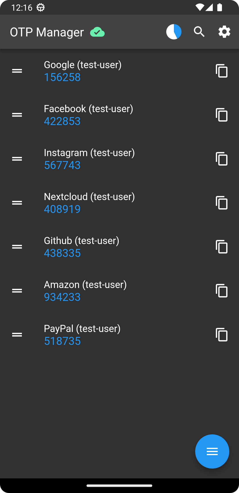
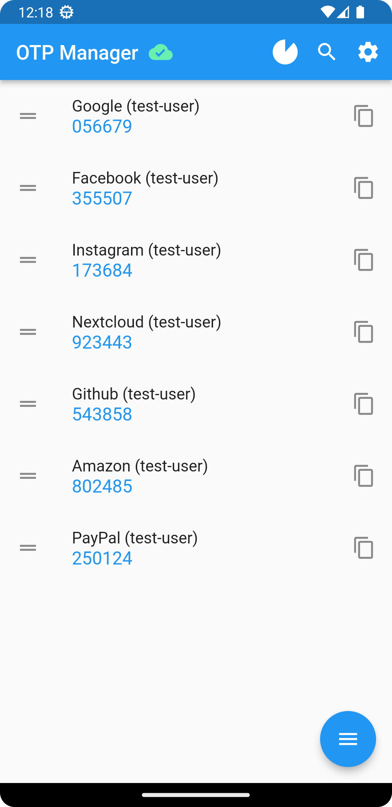
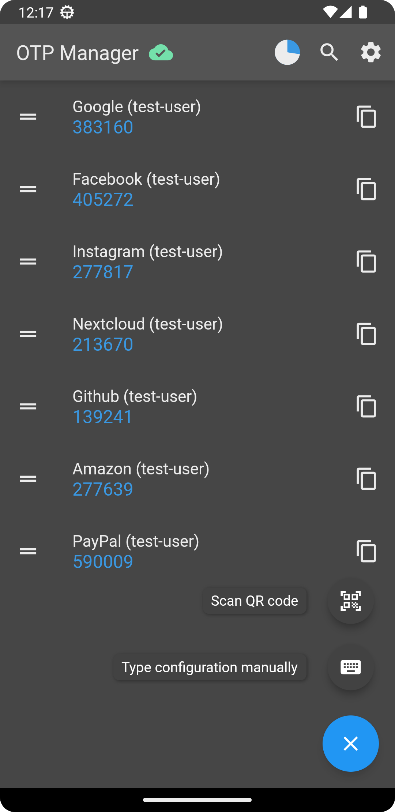
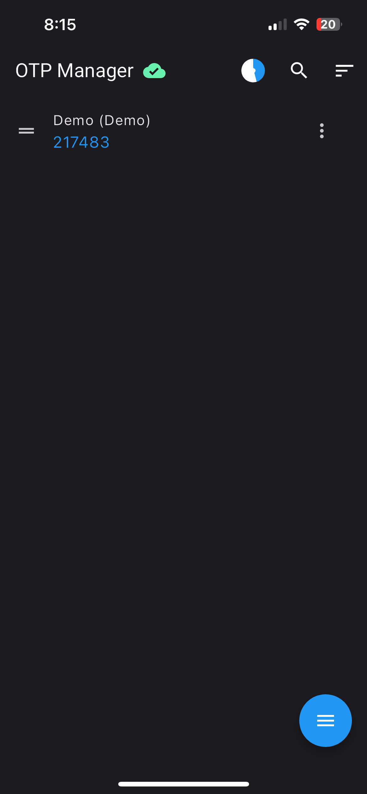
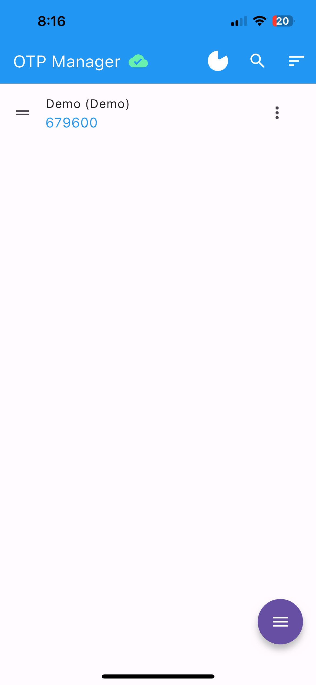
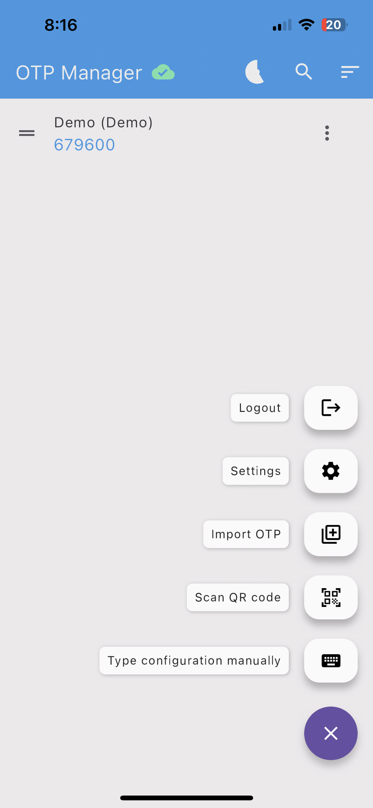

# OTP Manager

&nbsp;

*Read this in other languages: [Italian](README.it.md)*

*Official Nextcloud extension repository: [otpmanager-nextcloud](https://github.com/matteo-convertino/otpmanager-nextcloud)*

# Screenshots

Android: 
&emsp;&emsp; 
iOS: 
&emsp;&emsp;

 

# Description

OTP Manager is a useful application for both Android as well as iOS for those who use two-factor authentication (2FA) and want to manage their OTP codes securely and easily. This application allows you to synchronise your OTP codes with your personal Nextcloud server so that you can access them from multiple devices.

With OTP Manager, you no longer have to worry about losing your OTP codes or not having access to them when you need them. All you have to do is synchronise the app with your Nextcloud server and you will always have your OTP codes at hand, wherever you are.

OTP Manager offers the convenient feature of importing OTP codes from Google Authenticator by scanning the QR code. This means you don't have to spend time manually entering each OTP code, but can simply scan the QR code that the Google app generates when exporting accounts, and OTP Manager will automatically import your associated accounts.

This way, the transition from Google Authenticator to OTP Manager will be quick and easy, without having to waste time manually resetting all your OTP codes.

# Build instructions for iOS

1. Install Xcode and flutter
2. Download the project and open in Terminal
3. Run `flutter pub add device_info_plus`
4. Run `flutter pub get`
5. Run `flutter pub run build_runner build`
6. Run `flutter build ios`
7. This will give you Runner.app file, create a folder with name Payload and move Runner.app to it.
8. Compress the folder and change the .zip extension to .ipa
   
# Planned Features
- [ ] Give the possibility to organize the accounts in folders or, assigning a tag to the accounts, filter them during the search
- [ ] [[Feature Request] Show QR Code](https://github.com/matteo-convertino/otpmanager-app/issues/17)
- [ ] [[Feature Request] Allow setting icon](https://github.com/matteo-convertino/otpmanager-app/issues/18)
