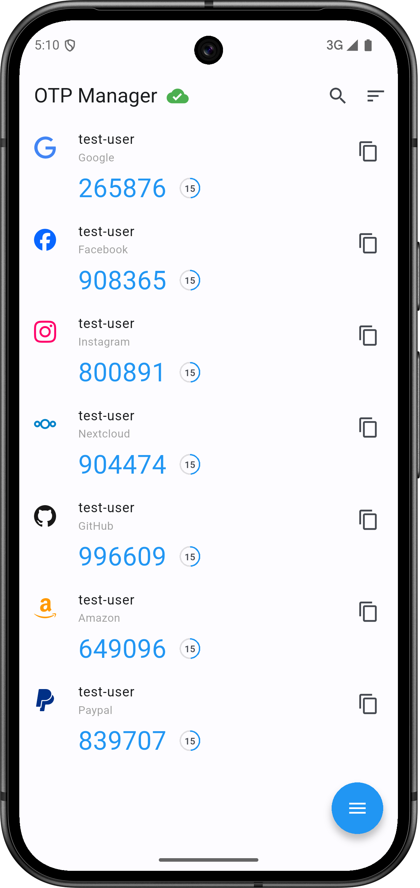
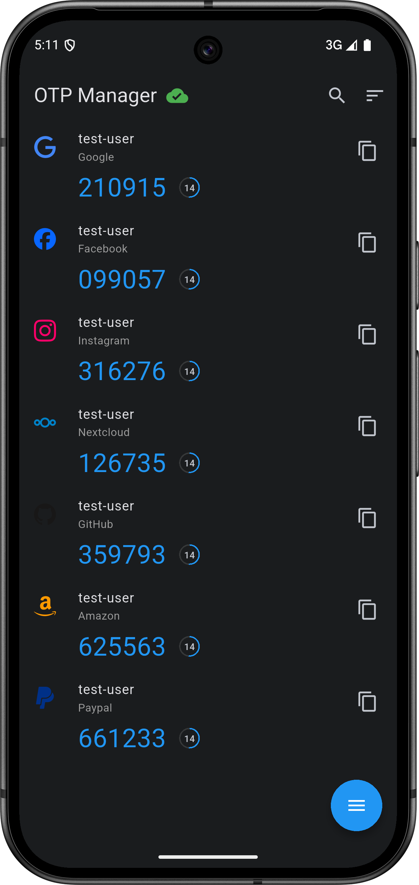
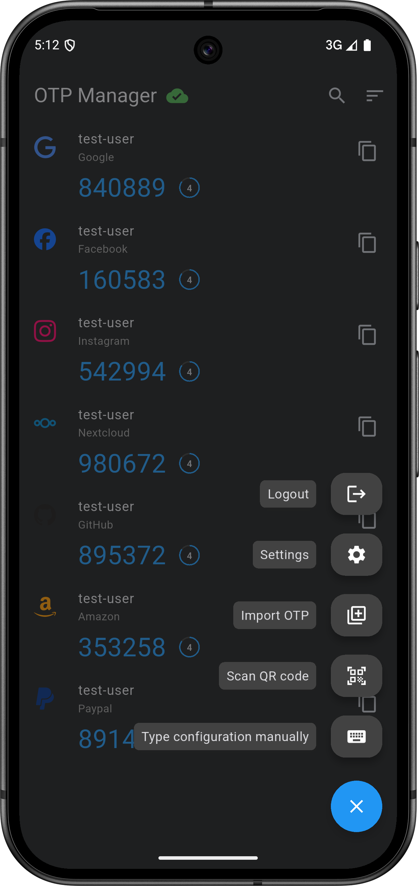

# OTP Manager

&nbsp;

# Useful Links
- *Official Nextcloud extension repository: [otpmanager-nextcloud](https://github.com/matteo-convertino/otpmanager-nextcloud)*
- *Medium article: [How to develop a Nextcloud App Extension (Part-1): A practical guide based on a real project](https://medium.com/@matteo-convertino/how-to-develop-a-nextcloud-app-extension-part-1-a-practical-guide-based-on-a-real-project-00b4395a64f7)*

# Screenshots

&emsp;&emsp; 

# Description

OTP Manager is a useful application for both Android as well as iOS for those who use two-factor authentication (2FA) and want to manage their OTP codes securely and easily. This application allows you to synchronise your OTP codes with your personal Nextcloud server so that you can access them from multiple devices.

With OTP Manager, you no longer have to worry about losing your OTP codes or not having access to them when you need them. All you have to do is synchronise the app with your Nextcloud server and you will always have your OTP codes at hand, wherever you are.

OTP Manager offers the convenient feature of importing OTP codes from Google Authenticator by scanning the QR code. This means you don't have to spend time manually entering each OTP code, but can simply scan the QR code that the Google app generates when exporting accounts, and OTP Manager will automatically import your associated accounts.

This way, the transition from Google Authenticator to OTP Manager will be quick and easy, without having to waste time manually resetting all your OTP codes.

# Contributors ✨

Special thanks go to these wonderful people:
<table>
  <tbody>
    <tr>
      <td align="center" valign="top" width="14.28%"><a href="https://github.com/davideserio"> <b>Davide Serio</b></a> </td>
      <td align="center" valign="top" width="14.28%"><a href="https://github.com/srijansaxena11"> <b>Srijan Saxena</b></a> </td>
    </tr>
  </tbody>
</table>

